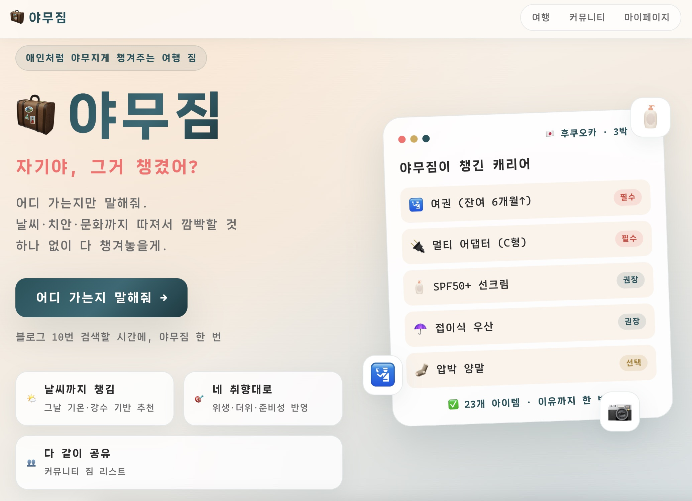
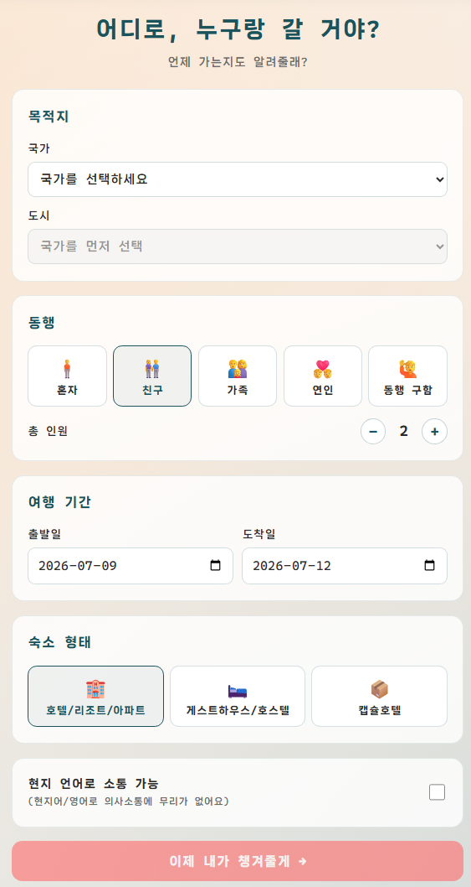
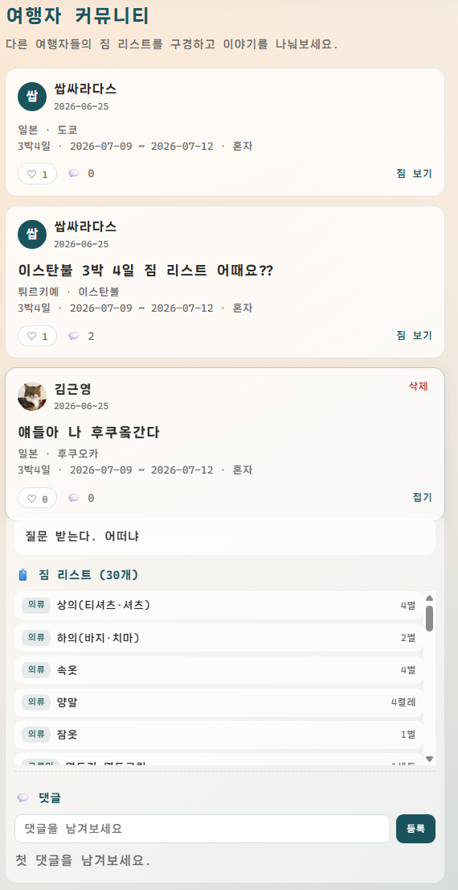
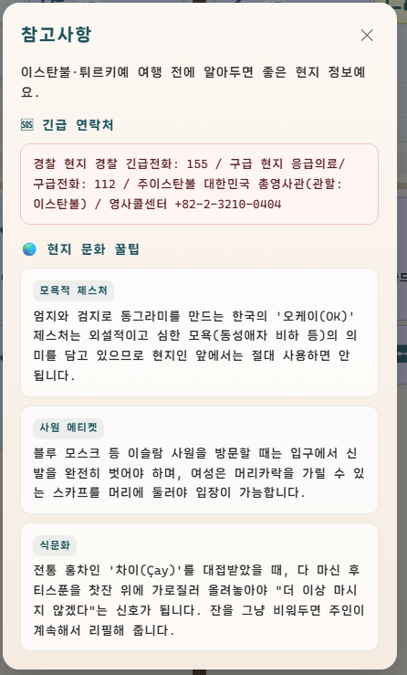
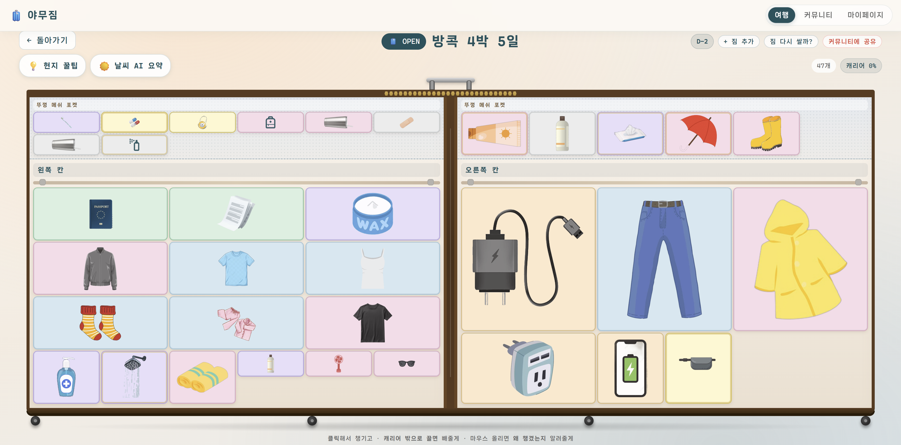
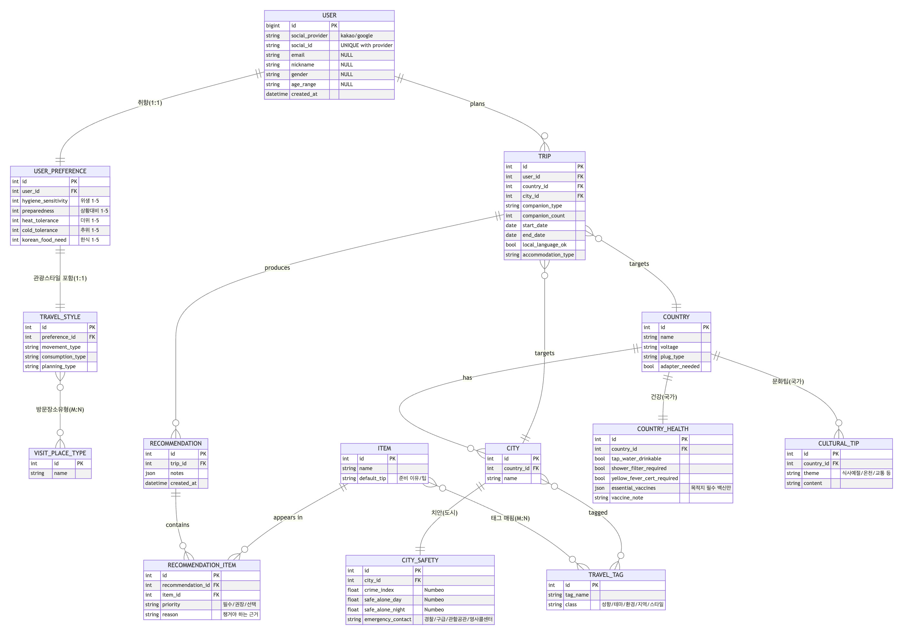

# 야무짐(YAMUJIM)

AI 기반 사용자 프로필 데이터와 여행 정보 맥락을 활용해 여행 준비물을 추천하는 서비스입니다.  
현재 구현 단계에서는 **규칙 기반 후보 추천 + 생성형 AI 필터링/정제**의 2단계 파이프라인으로 사용자에게 맞춤형 짐 리스트를 제공합니다.

## 시연 영상

[](https://youtu.be/3iX39dVS9ss)

👉 [시연 영상 바로가기](https://youtu.be/3iX39dVS9ss)

## 서비스 화면











## A. 팀원 정보 및 업무 분담

| 이름 | 역할 | 담당 업무 |
| --- | --- | --- |
| 최현규 | 팀장 | 추천 엔진 구현, DB 데이터 수집 및 시드 데이터 구성 |
| 김근영 | 팀원 | 프론트엔드 UI 디자인, User Flow 구성, DB 데이터 수집 및 시드 데이터 구성 |

## B. 목표 서비스 및 설계 구현 정도

### 목표 서비스

여행자는 목적지, 일정, 동행 형태, 숙소, 현지 언어 가능 여부, 개인 성향을 입력합니다. 야무짐은 이 정보를 바탕으로 날씨, 치안, 문화, 건강, 전압/플러그, 여행 스타일을 함께 고려해 준비물과 준비 이유를 제안합니다.

### 주요 사용자 흐름

1. 카카오 로그인 또는 개발용 로그인으로 서비스 접속
2. 성별, 생년월일, 닉네임 등 기본 프로필 입력
3. 위생 민감도, 준비성, 더위/추위 민감도, 한식 필요도, 여행 스타일 입력
4. 여행 국가/도시, 일정, 동행, 숙소, 현지 언어 가능 여부 입력
5. 추천 결과 생성 및 캐리어 형태의 준비물 UI 확인
6. 추천 결과를 커뮤니티에 공유하고 댓글/좋아요로 소통

### 구현 완료 범위

- 사용자 인증: 카카오 OAuth, 개발용 로그인, JWT 발급/갱신
- 사용자 프로필: 닉네임, 프로필 이미지, 성별, 생년월일, 연령대 계산
- 취향 입력: 5점 척도 성향, 이동/소비/계획 성향, 방문 장소 유형
- 여행 등록: 국가/도시, 기간, 동행 유형, 인원, 숙소 유형, 언어 가능 여부
- 목적지 데이터: 국가, 도시, 도시 좌표, 치안, 건강, 문화 팁, 환경 태그
- 날씨 연동: OpenWeather One Call 4.0 daily, Open-Meteo UV 보정, Redis 캐싱
- 추천 생성: 규칙 기반 후보 수집, 태그 가중치 점수화, LLM 필터링/랭킹, fallback 처리
- 추천 결과: 일반 준비물과 카탈로그 준비물 분리, 우선순위/카테고리/추천 이유 제공
- 커뮤니티: 추천 결과 공유, 게시글 목록/상세, 좋아요, 댓글/대댓글, 수정/삭제
- 마이페이지: 내 프로필, 여행 기록, 내가 공유한 글 관리

### 기술 스택

| 영역 | 사용 기술 |
| --- | --- |
| Frontend | Vue 3, Vite, Vue Router, Pinia, Axios |
| Backend | Django 5.2.4, Django REST Framework, Simple JWT, drf-spectacular |
| Database | SQLite 개발 DB, Django ORM |
| Cache | Redis |
| External API | Kakao OAuth, OpenWeather, Open-Meteo, GMS LLM Gateway |
| Data | CSV/JSON 기반 국가/도시/태그/준비물/치안/건강/문화 데이터 |

## C. 데이터베이스 모델링(ERD)



### 핵심 모델 구조

- `User`: 소셜 로그인 기반 사용자, 프로필, 성별/연령 정보
- `UserPreference`: 위생 민감도, 준비성, 더위/추위 민감도, 한식 필요도
- `TravelStyle`: 이동 성향, 소비 성향, 계획 성향, 방문 장소 유형
- `Country`, `City`: 목적지 국가/도시, 도시 좌표, 전압/플러그 정보
- `CountryHealth`: 수돗물, 샤워필터, 황열병 증명서, 필수 백신 정보
- `CitySafety`: Numbeo 기반 치안 지수, 주야간 안전도, 긴급 연락처
- `CulturalTip`: 국가별 문화/예절/팁
- `TravelTag`, `EnvironmentTag`: 여행 성향, 테마, 환경, 지역 특성 태그
- `Item`: 준비물 마스터 데이터와 관련 태그
- `Trip`: 사용자가 등록한 여행 정보
- `Recommendation`, `RecommendationItem`: 여행별 추천 결과와 개별 추천 준비물
- `CommunityPost`, `PostLike`, `Comment`: 추천 결과 공유와 커뮤니티 상호작용

## D. 추천 알고리즘에 대한 기술적 설명

야무짐의 추천은 현재 **1차 규칙 기반 후보 생성**과 **2차 생성형 AI 필터링/정제**로 구성되어 있습니다.

### 1단계: 규칙 기반 후보 생성

백엔드는 여행 정보와 사용자 정보를 하나의 추천 컨텍스트로 구성합니다.

- 사용자 프로필: 성별, 나이, 연령대
- 사용자 취향: 위생 민감도, 준비성, 더위/추위 민감도, 한식 필요도
- 여행 스타일: 이동/소비/계획 성향, 방문 장소 유형
- 목적지 정보: 국가 건강 정보, 도시 치안, 문화 팁, 도시/환경 태그
- 날씨 정보: 기온, 체감온도, 습도, UV, 강수/적설, 구름량

이후 `TravelTag`와 `Item`의 관계를 이용해 관련 준비물 후보를 수집합니다. 태그별 가중치를 적용해 후보 점수를 계산하고, 날씨와 상충하는 아이템은 제외합니다. 예를 들어 더운 여행지에서는 방한 전용 아이템을 낮추거나 제외하고, 강수량이 높은 경우 방수/우천 관련 아이템의 점수를 높입니다.

### 2단계: 생성형 AI 필터링 및 추천 이유 생성

규칙 기반으로 정렬된 후보 카탈로그를 LLM에 전달합니다. LLM은 새로운 카탈로그 아이템을 invent하지 않고, 백엔드가 전달한 `item_id` 안에서만 선택합니다.

LLM의 역할은 다음과 같습니다.

- 후보 아이템 중 실제 여행 맥락에 맞는 항목 선별
- 필수/권장/선택 우선순위 조정
- 문서, 충전기, 세면도구, 의약품 등 일반 준비물 보강
- 여행지, 일정, 날씨, 사용자 프로필을 반영한 한국어 추천 이유 작성

LLM 호출이 실패하거나 응답 검증에 실패하면, 백엔드는 규칙 기반 fallback 결과를 사용합니다. 따라서 AI 응답에만 의존하지 않고 기본 추천 결과를 유지할 수 있도록 설계했습니다.

### 추천 결과 검증

LLM 응답은 저장 전에 다음 기준으로 검증합니다.

- 존재하지 않는 `item_id` 제거
- 중복 아이템 제거
- 허용된 우선순위(`required`, `recommended`, `optional`)만 저장
- 일반 준비물과 카탈로그 준비물의 중복 제거
- 날씨/숙소/여행 스타일과 충돌하는 항목 제외 또는 우선순위 하향

### 어려웠던 점

가장 어려웠던 부분은 정확한 추천 품질을 구현하는 과정이었습니다. 현재 서비스는 규칙 기반 추천과 AI 기반 추천이 혼재된 구조이며, 사용자가 프로필과 취향 입력 단계에서 제공하는 변인도 위생 민감도, 준비성, 더위 민감도, 추위 민감도, 한식 필요도 등 5개 이상입니다.

이처럼 고려해야 할 입력값이 많다 보니 어떤 변인을 얼마나 강하게 반영할지 결정하는 가중치 설계가 쉽지 않았습니다. 단순히 많은 준비물을 추천하면 사용성이 떨어지고, 반대로 너무 적게 추천하면 여행 맥락을 충분히 반영하지 못하는 문제가 있었습니다. 따라서 사용자 성향, 목적지 태그, 날씨, 치안, 건강 정보, 여행 스타일을 함께 고려하면서도 과도한 추천을 줄이기 위한 점수화 기준과 필터링 로직을 조정하는 과정이 가장 난이도 높았습니다.

또한 AI가 추천 이유를 자연스럽게 생성할 수 있다는 장점은 있었지만, AI 응답만 신뢰하면 존재하지 않는 아이템을 추천하거나 맥락과 맞지 않는 항목이 포함될 수 있었습니다. 이를 보완하기 위해 백엔드에서 먼저 규칙 기반 후보를 만들고, AI는 해당 후보 안에서만 선택하도록 제한했으며, 최종 저장 전 검증 로직을 추가해 추천 품질을 안정화했습니다.

## E. 핵심 기능 설명

### 맞춤형 준비물 추천

사용자가 여행 정보를 입력하면 백엔드가 여행별 추천 결과를 생성합니다. 결과는 일반 준비물과 카탈로그 기반 전문 준비물로 나뉘며, 각 항목에는 카테고리, 우선순위, 추천 이유가 포함됩니다.

### 여행지 날씨 요약

OpenWeather One Call 4.0 daily API로 여행 날짜별 날씨를 조회하고, Open-Meteo Forecast API로 UV 지수를 보정합니다. Redis를 사용해 동일 여행의 날씨 응답을 3시간 캐싱합니다.

### 목적지 정보 제공

국가별 문화 팁과 도시별 긴급 연락처를 프론트엔드에서 함께 보여줍니다. 여행자는 준비물뿐 아니라 현지 주의사항도 한 화면에서 확인할 수 있습니다.

### 커뮤니티 공유

추천 결과를 게시글로 공유할 수 있습니다. 공유 시 추천 결과의 일반 준비물과 카탈로그 준비물 스냅샷을 저장해, 이후 추천 결과가 변경되어도 공유 당시의 짐 리스트를 유지합니다.

### 마이페이지

사용자는 내 프로필, 프로필 이미지, 닉네임, 여행 기록, 내가 공유한 게시글을 확인하고 관리할 수 있습니다.

## F. 생성형 AI를 활용한 부분

생성형 AI는 추천 파이프라인의 2단계에서 사용됩니다.

- 입력 데이터: 사용자 프로필, 취향, 여행 정보, 목적지 맥락, 날씨 요약, 규칙 기반 후보 카탈로그
- 출력 데이터: 일반 준비물 목록, 카탈로그 준비물 선택, 우선순위, 추천 이유
- 사용 모델: 기본 `gpt-5-nano`, 선택 모델 `gemini-2.5-flash-lite`, `gemini-3.5-flash`, `claude-haiku-4-5-20251001`
- 호출 방식: GMS Gateway를 통한 Chat Completions/Gemini/Anthropic API 호출

AI 활용 시 안전장치는 다음과 같습니다.

- LLM은 백엔드가 전달한 카탈로그 후보 내 `item_id`만 선택 가능
- JSON 스키마 기반 응답만 파싱
- 잘못된 ID, 중복, 잘못된 우선순위 제거
- 실패 시 규칙 기반 fallback 추천 사용

## G. 서비스 URL

현재 저장소 기준 배포 URL은 확인되지 않았습니다.

로컬 실행 URL은 다음과 같습니다.

- Frontend: `http://localhost:5173`
- Backend API: `http://127.0.0.1:8000/api/v1/`
- Swagger 문서: `http://127.0.0.1:8000/api/v1/docs/`

## 프로젝트 구조

```text
13_pjt/
├── backend/                 # Django REST API 서버
│   ├── accounts/            # 인증, 사용자, 취향/여행 스타일
│   ├── places/              # 국가, 도시, 치안, 건강, 문화, 태그
│   ├── trips/               # 여행 등록, 날씨 조회
│   ├── recommendations/     # 추천 엔진, 아이템, 추천 결과
│   ├── community/           # 추천 공유 게시글, 댓글, 좋아요
│   └── config/              # Django 설정
├── frontend/                # Vue 3 + Vite 프론트엔드
│   ├── src/api/             # API 클라이언트
│   ├── src/views/           # 주요 페이지
│   ├── src/components/      # UI 컴포넌트
│   └── src/packing/         # 추천 결과 화면 배치/가공 로직
├── data/dev_assets/         # CSV/JSON 시드 데이터
├── data/generate_data/      # 데이터 생성/수집 스크립트
├── docs/erd/                # ERD 원본
└── images_ppt/              # 발표/README 이미지
```

## 실행 방법

### 1. 백엔드 실행

```powershell
cd backend
python -m pip install -r requirements.txt
python manage.py migrate
python manage.py seed_data
python manage.py seed_visit_types
python manage.py seed_demographic_items
python manage.py runserver
```

Redis가 필요한 경우:

```powershell
docker run --name yamujim-redis -p 6379:6379 -d redis
```

이미 컨테이너가 있다면:

```powershell
docker start yamujim-redis
```

### 2. 프론트엔드 실행

```powershell
cd frontend
npm install
npm run dev
```

Vite 개발 서버는 `/api` 요청을 Django 서버(`http://127.0.0.1:8000`)로 프록시합니다.

### 3. 환경 변수

프로젝트 루트의 `.env`에 다음 값을 설정합니다.

```env
OPEN_WEATHER_KEY=...
KAKAO_API_KEY=...
KAKAO_CLIENT_SECRET=...
KAKAO_REDIRECT_URI=http://localhost:5173/auth/kakao/callback
GMS_KEY=...
REDIS_URL=redis://127.0.0.1:6379/1
```

## 주요 API

| 기능 | Method | Endpoint |
| --- | --- | --- |
| 카카오 로그인 URL | GET | `/api/v1/auth/kakao/url/` |
| 카카오 로그인 | POST | `/api/v1/auth/kakao/` |
| 개발용 로그인 | POST | `/api/v1/auth/dev/` |
| 내 정보 조회/수정 | GET/PUT/PATCH | `/api/v1/auth/me/` |
| 취향 조회/저장 | GET/PUT | `/api/v1/me/preference/` |
| 국가 목록 | GET | `/api/v1/countries/` |
| 도시 목록 | GET | `/api/v1/cities/?country={id}` |
| 여행 CRUD | GET/POST | `/api/v1/trips/` |
| 여행 날씨 | GET | `/api/v1/trips/{trip_id}/weather/` |
| 추천 생성 | POST | `/api/v1/trips/{trip_id}/recommendations/` |
| 최신 추천 조회 | GET | `/api/v1/trips/{trip_id}/recommendations/latest/` |
| 추천 상세 조회 | GET | `/api/v1/recommendations/{recommendation_id}/` |
| 커뮤니티 게시글 | GET/POST | `/api/v1/community/posts/` |
| 댓글 | GET/POST | `/api/v1/community/posts/{post_id}/comments/` |

## 데이터 출처 및 구성

- `countries.csv`: 국가 기본 정보
- `cities.csv`: 도시, 국가 매핑, 여행 테마 태그
- `city_coordinates.json`: 도시 좌표 캐시
- `items.csv`: 준비물 마스터와 관련 태그
- `tags.csv`: 추천 신호 태그
- `city_environment_tags.csv`: 도시별 환경/지역 특성 태그
- `health_country.json`: 국가별 건강/백신/수돗물 정보
- `safety_city.json`: 도시별 치안/안전도/긴급 연락처
- `cultural_tips_country.json`: 국가별 문화 팁
